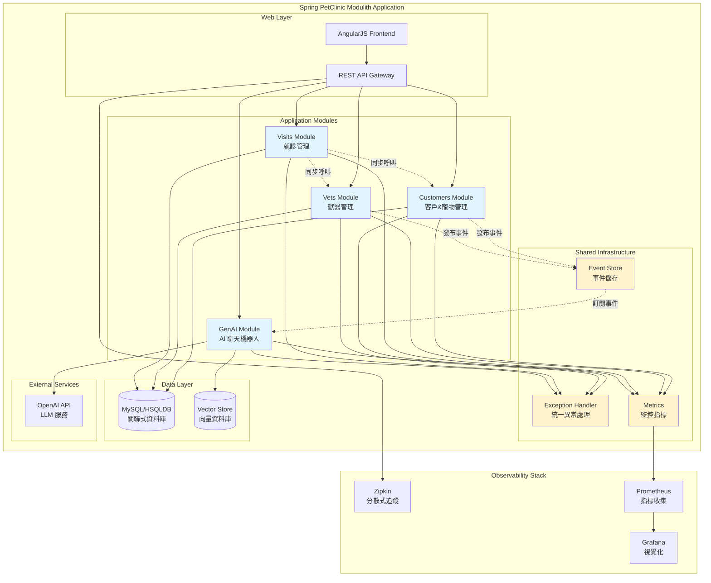
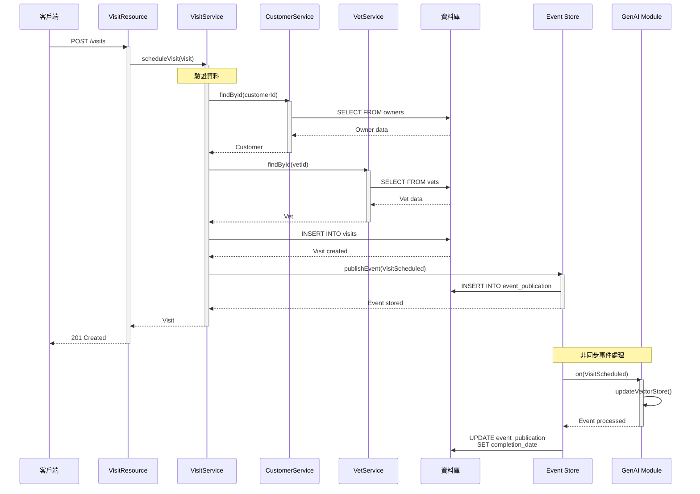
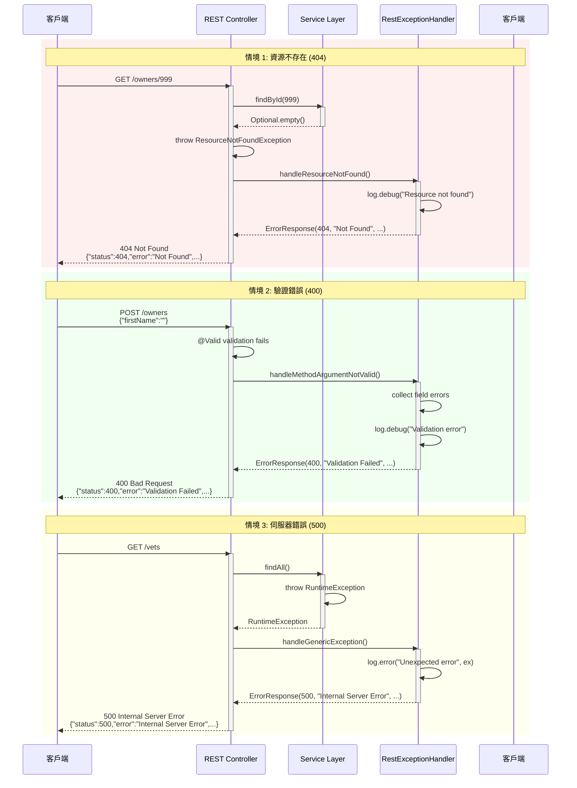
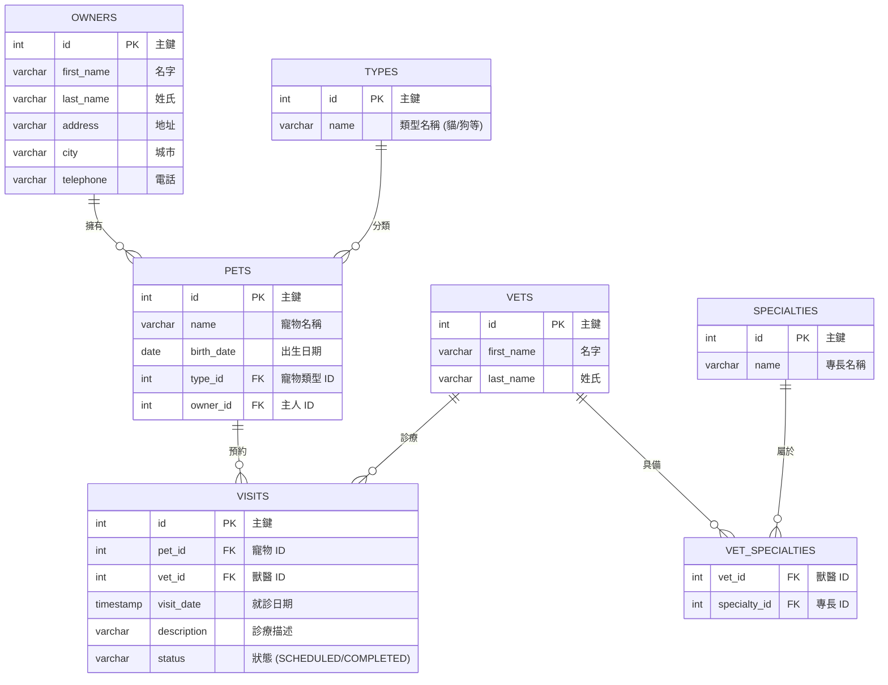
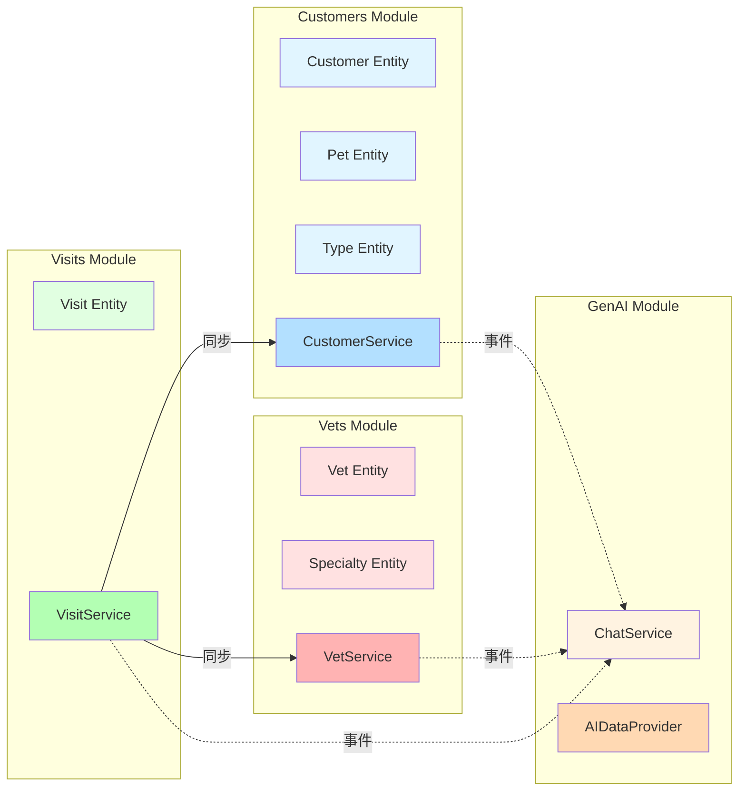
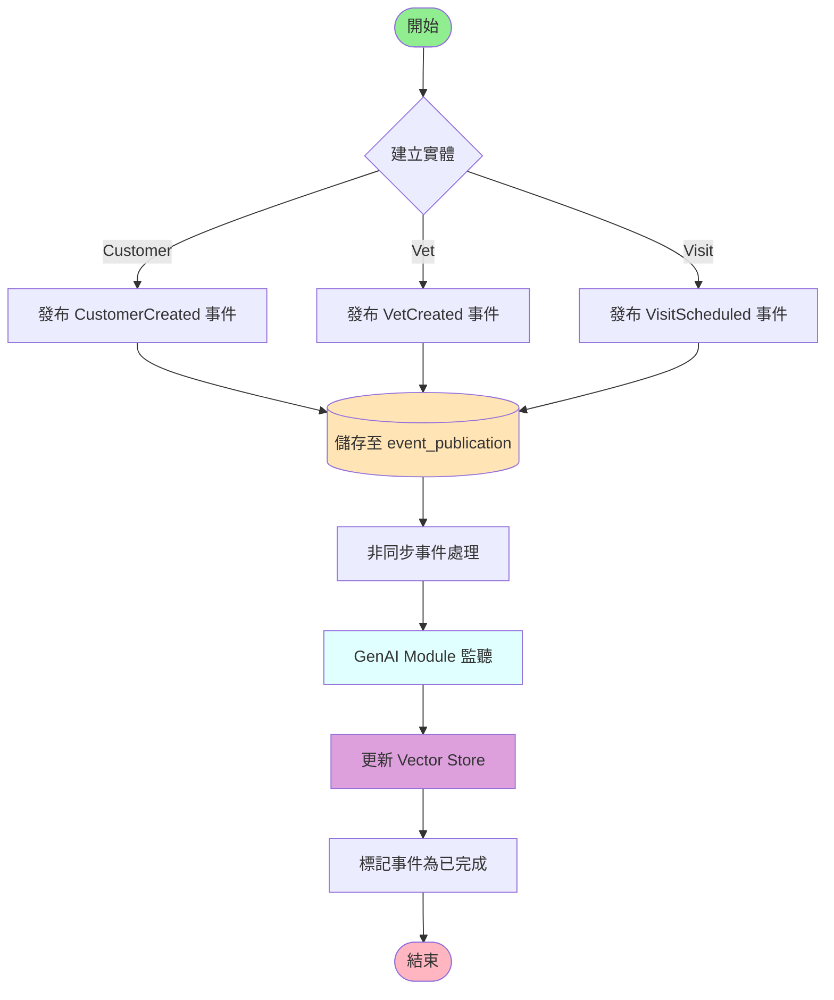

# Spring PetClinic Modulith - 架構圖表

本文件包含 Spring PetClinic Modulith 應用程式的詳細架構圖表、循序圖、資料庫 Schema 和 ER-Diagram。

## 目錄

- [系統架構圖](#系統架構圖)
- [循序圖](#循序圖)
  - [建立就診記錄](#建立就診記錄)
  - [異常處理流程](#異常處理流程)
- [資料庫 Schema](#資料庫-schema)
- [ER-Diagram](#er-diagram)

---

## 系統架構圖

整體系統架構展示了各個模組之間的關係以及與外部服務的整合:



### 架構說明

**Web Layer (網頁層)**:
- **AngularJS Frontend**: 使用者介面
- **REST API Gateway**: 統一的 API 入口點

**Application Modules (應用程式模組)**:
- **Customers Module**: 管理客戶和寵物資訊
- **Vets Module**: 管理獸醫資訊和專長
- **Visits Module**: 管理就診記錄
- **GenAI Module**: AI 聊天機器人功能

**Shared Infrastructure (共享基礎設施)**:
- **Exception Handler**: 統一的錯誤處理機制
- **Event Store**: Spring Modulith 事件儲存
- **Metrics**: Micrometer 監控指標

**Data Layer (資料層)**:
- **MySQL/HSQLDB**: 主要關聯式資料庫
- **Vector Store**: AI 向量資料儲存

**External Services (外部服務)**:
- **OpenAI API**: 大型語言模型服務

**Observability Stack (可觀測性堆疊)**:
- **Zipkin**: 分散式追蹤
- **Prometheus**: 指標收集
- **Grafana**: 視覺化儀表板

---

## 循序圖

### 建立就診記錄

展示當客戶端建立新的就診記錄時,系統各個組件之間的互動流程:



### 異常處理流程

展示系統如何處理不同類型的異常,並返回標準化的錯誤響應:



---

## 資料庫 Schema

### 完整 MySQL Schema

```sql
-- Spring PetClinic Modulith - Unified MySQL Database Schema
-- Contains all tables from: Customers, Vets, Visits, and Modulith Event Store

CREATE DATABASE IF NOT EXISTS petclinic;

USE petclinic;

-- ==========================================
-- Customers Module Tables
-- ==========================================

CREATE TABLE IF NOT EXISTS types (
  id INT(4) UNSIGNED NOT NULL AUTO_INCREMENT PRIMARY KEY,
  name VARCHAR(80),
  INDEX(name)
) engine=InnoDB;

CREATE TABLE IF NOT EXISTS owners (
  id INT(4) UNSIGNED NOT NULL AUTO_INCREMENT PRIMARY KEY,
  first_name VARCHAR(30),
  last_name VARCHAR(30),
  address VARCHAR(255),
  city VARCHAR(80),
  telephone VARCHAR(20),
  INDEX(last_name)
) engine=InnoDB;

CREATE TABLE IF NOT EXISTS pets (
  id INT(4) UNSIGNED NOT NULL AUTO_INCREMENT PRIMARY KEY,
  name VARCHAR(30),
  birth_date DATE,
  type_id INT(4) UNSIGNED NOT NULL,
  owner_id INT(4) UNSIGNED NOT NULL,
  INDEX(name),
  FOREIGN KEY (owner_id) REFERENCES owners(id),
  FOREIGN KEY (type_id) REFERENCES types(id)
) engine=InnoDB;

-- ==========================================
-- Vets Module Tables
-- ==========================================

CREATE TABLE IF NOT EXISTS vets (
  id INT(4) UNSIGNED NOT NULL AUTO_INCREMENT PRIMARY KEY,
  first_name VARCHAR(30),
  last_name VARCHAR(30),
  INDEX(last_name)
) engine=InnoDB;

CREATE TABLE IF NOT EXISTS specialties (
  id INT(4) UNSIGNED NOT NULL AUTO_INCREMENT PRIMARY KEY,
  name VARCHAR(80),
  INDEX(name)
) engine=InnoDB;

CREATE TABLE IF NOT EXISTS vet_specialties (
  vet_id INT(4) UNSIGNED NOT NULL,
  specialty_id INT(4) UNSIGNED NOT NULL,
  FOREIGN KEY (vet_id) REFERENCES vets(id),
  FOREIGN KEY (specialty_id) REFERENCES specialties(id),
  UNIQUE (vet_id,specialty_id)
) engine=InnoDB;

-- ==========================================
-- Visits Module Tables
-- ==========================================

CREATE TABLE IF NOT EXISTS visits (
    id INT(4) UNSIGNED AUTO_INCREMENT NOT NULL PRIMARY KEY,
    pet_id INT(4) UNSIGNED NOT NULL,
    vet_id INT(4) UNSIGNED NOT NULL,
    visit_date TIMESTAMP DEFAULT CURRENT_TIMESTAMP,
    description VARCHAR(8192),
    status VARCHAR(20) DEFAULT 'SCHEDULED',
    FOREIGN KEY (pet_id) REFERENCES pets(id),
    FOREIGN KEY (vet_id) REFERENCES vets(id),
    INDEX idx_visits_pet_id (pet_id),
    INDEX idx_visits_vet_id (vet_id),
    INDEX idx_visits_status (status)
) engine=InnoDB;

-- ==========================================
-- Spring Modulith Event Store
-- ==========================================

CREATE TABLE IF NOT EXISTS event_publication (
  id CHAR(36) NOT NULL PRIMARY KEY COMMENT 'UUID',
  event_type VARCHAR(255) NOT NULL COMMENT 'Type of the published domain event',
  serialized_event LONGBLOB NOT NULL COMMENT 'The serialized form of the domain event',
  listener_id VARCHAR(255) NOT NULL COMMENT 'The listener id or listener class name',
  publication_date TIMESTAMP NOT NULL COMMENT 'When the event was published',
  completion_date TIMESTAMP NULL COMMENT 'When the publication was completed',
  UNIQUE KEY event_type_listener_id (event_type, listener_id, publication_date),
  KEY idx_completion_date (completion_date),
  KEY idx_event_type (event_type)
) engine=InnoDB;
```

### 表說明

| 表名 | 模組 | 說明 |
|-----|------|------|
| **types** | Customers | 寵物類型 (貓、狗等) |
| **owners** | Customers | 寵物主人/客戶資訊 |
| **pets** | Customers | 寵物資訊 |
| **vets** | Vets | 獸醫資訊 |
| **specialties** | Vets | 獸醫專長 (外科、牙科等) |
| **vet_specialties** | Vets | 獸醫與專長的關聯 (多對多) |
| **visits** | Visits | 就診記錄 |
| **event_publication** | Spring Modulith | 領域事件發布記錄 |

---

## ER-Diagram

實體關係圖展示資料庫表之間的關係:



### 關係說明

1. **Owners ↔ Pets**: 一對多關係
   - 一個客戶可以擁有多隻寵物
   - 每隻寵物屬於一個客戶

2. **Types ↔ Pets**: 一對多關係
   - 一種寵物類型可以有多隻寵物
   - 每隻寵物屬於一種類型

3. **Vets ↔ Specialties**: 多對多關係 (透過 vet_specialties)
   - 一個獸醫可以有多個專長
   - 一個專長可以被多個獸醫擁有

4. **Pets ↔ Visits**: 一對多關係
   - 一隻寵物可以有多次就診記錄
   - 每次就診屬於一隻寵物

5. **Vets ↔ Visits**: 一對多關係
   - 一個獸醫可以有多次診療記錄
   - 每次就診由一個獸醫負責

---

## 模組邊界圖



### 模組邊界規則

1. **允許的通訊方式**:
   - ✅ 模組可以呼叫其他模組的公開介面 (public API)
   - ✅ 模組可以透過事件進行非同步通訊
   - ❌ 模組不可存取其他模組的 `internal/` 套件
   - ❌ 模組之間不可有循環依賴

2. **編譯時驗證**:
   - Spring Modulith 會在編譯時檢查模組邊界
   - `ModulithStructureTest` 會驗證架構規則

3. **執行時監控**:
   - 模組間的呼叫會被追蹤
   - 事件發布和處理會被記錄

---

## 事件流程圖



---

## 附錄

### 相關文件

- **[README.md](../README.md)** - 專案主要文件
- **[CLAUDE.md](../CLAUDE.md)** - Claude Code 使用指南
- **[ARCHITECTURE_DECISIONS.md](../spring-petclinic-modulith/ARCHITECTURE_DECISIONS.md)** - 架構決策記錄
- **[DEVELOPER_GUIDE.md](../spring-petclinic-modulith/DEVELOPER_GUIDE.md)** - 開發者指南

### 技術參考

- [Spring Modulith 官方文件](https://spring.io/projects/spring-modulith)
- [Spring AI 官方文件](https://spring.io/projects/spring-ai)
- [Mermaid 語法參考](https://mermaid.js.org/)

---

**最後更新**: 2025-11-22
**版本**: 3.4.1
