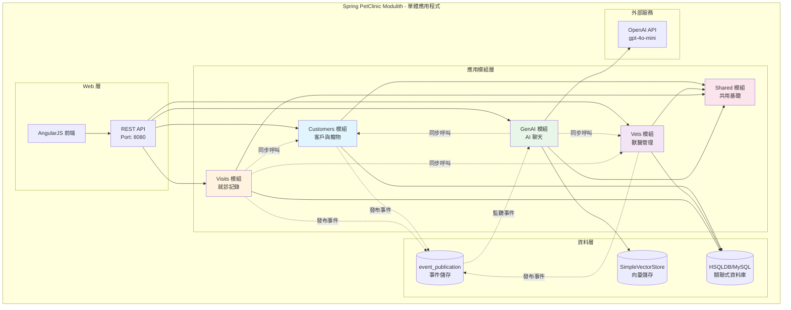
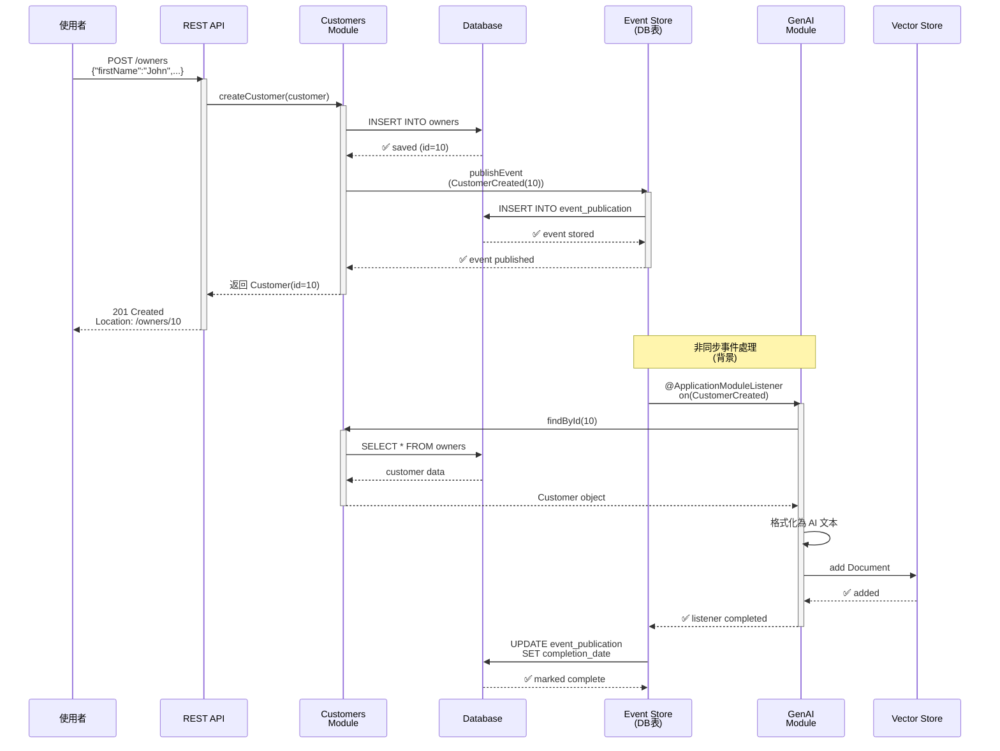
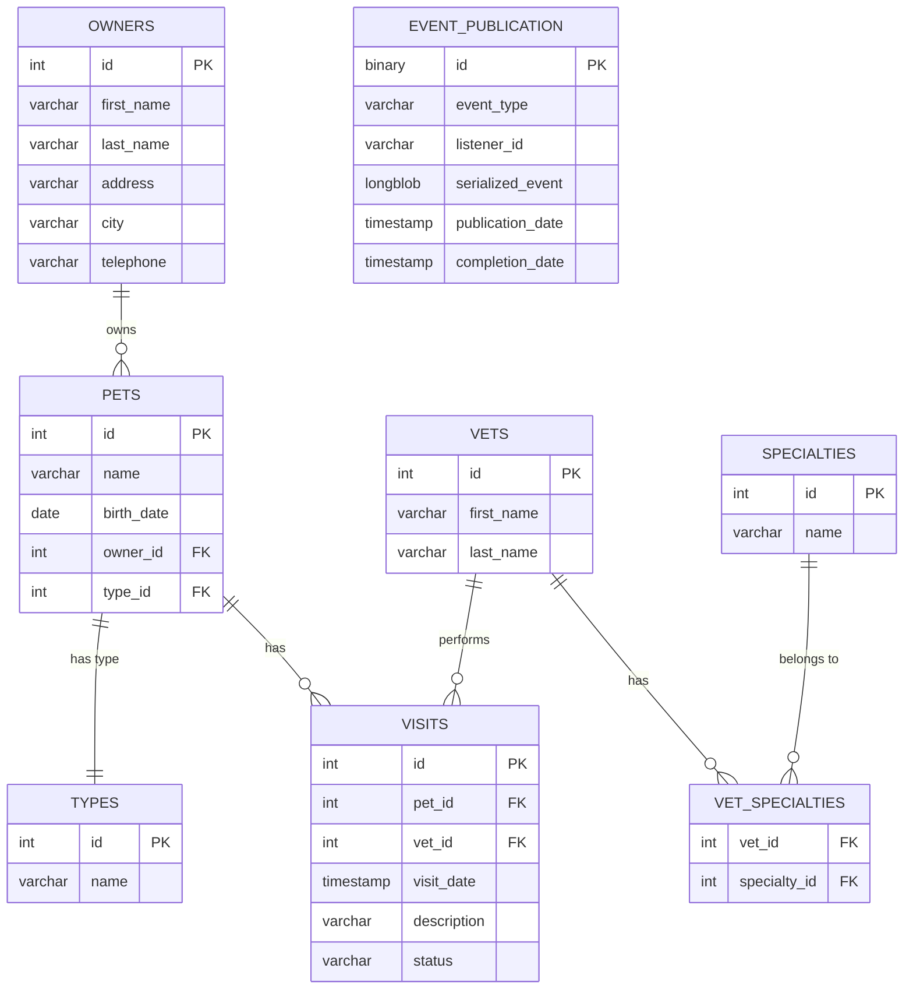

# Spring PetClinic 模組化單體應用 - 完整初學者指南

[](https://github.com/spring-petclinic/spring-petclinic-microservices/actions/workflows/maven-build.yml)
[](https://opensource.org/licenses/Apache-2.0)

本專案展示了如何使用 [Spring Modulith](https://spring.io/projects/spring-modulith) 建置**模組化單體應用**。這是 Spring PetClinic 微服務應用的重構版本，將其轉換為一個具有清晰模組邊界的單體應用，同時保留了微服務的模組化優勢。

---

## 📖 目錄

1. [🎯 為什麼選擇 Spring Modulith?](#-為什麼選擇-spring-modulith)
2. [🚀 5 分鐘快速開始](#-5-分鐘快速開始)
3. [💡 初學者必讀：Spring Modulith 核心概念](#-初學者必讀spring-modulith-核心概念)
4. [🏗️ 專案架構一覽](#️-專案架構一覽)
5. [📦 詳細設定與執行](#-詳細設定與執行)
6. [📡 API 文檔與測試](#-api-文檔與測試)
7. [🧪 測試與驗證](#-測試與驗證)
8. [📚 進階學習與文件](#-進階學習與文件)
9. [🆚 對比：微服務 vs 模組化單體](#-對比微服務-vs-模組化單體)

---

## 🎯 為什麼選擇 Spring Modulith?

Spring Modulith 提供了微服務的模組化優勢，同時完全避免了分散式系統的複雜性：

| 特點 | 說明 |
|------|------|
| ✅ **清晰的模組邊界** | 在編譯時強制執行模組隔離，防止跨越模組邊界 |
| ✅ **事件驅動架構** | 模組間鬆耦合，透過領域事件進行非同步通訊 |
| ✅ **單一部署單元** | 無需複雜的服務編排和網路調用 |
| ✅ **完整的可觀測性** | 內建 Actuator、OpenTelemetry、Zipkin 追蹤支援 |
| ✅ **更快的開發速度** | 簡化本地開發、測試和除錯，加快開發效率 |
| ✅ **無服務發現複雜性** | 不需要 Eureka、Consul 等服務發現工具 |

---

## 🚀 5 分鐘快速開始

### 前置需求

在開始之前，請確保已安裝：

- **Java 17+** 或 **Java 21 LTS**（推薦）
- **Maven 3.8.1+**
- **Git**（用於版本控制）
- **Docker**（可選，用於完整的可觀測性堆疊）

檢查已安裝版本：
```bash
java -version
mvn -version
```

### 方式 1: 5 秒最快開始（推薦新手）

```bash
# 進入專案目錄
cd spring-petclinic-modulith/spring-petclinic-modulith

# 執行應用程式（使用內嵌 HSQLDB 資料庫）
../../mvnw spring-boot:run

# 等待大約 15-20 秒...
# ✅ 應用程式啟動完成！
```

**存取應用程式**：
- 首頁：http://localhost:8080
- 寵物列表：http://localhost:8080/#/pets
- 獸醫列表：http://localhost:8080/#/vets
- **API 文檔 (Swagger UI)**：http://localhost:8080/swagger-ui.html
- **OpenAPI 規格 (JSON)**：http://localhost:8080/v3/api-docs
- 健康檢查：http://localhost:8080/actuator/health

### 方式 2: 完整堆疊（含監控）

```bash
# 在專案根目錄執行
cd spring-petclinic-modulith

# 啟動完整的技術堆疊
docker-compose up

# 等待各服務啟動...
```

這將啟動以下服務：

| 服務 | 網址 | 用途 |
|------|------|------|
| **PetClinic 應用** | http://localhost:8080 | 主應用程式 |
| **MySQL 資料庫** | localhost:3306 | 持久化資料存儲 |
| **Zipkin 追蹤** | http://localhost:9411 | 分散式追蹤 UI |
| **Prometheus 指標** | http://localhost:9091 | 指標收集 |
| **Grafana 儀表板** | http://localhost:3000 | 監控視覺化（密碼：admin/admin） |

---

## 💡 初學者必讀：Spring Modulith 核心概念

### 什麼是 Spring Modulith？

**Spring Modulith** 是一個幫助開發者在**單一應用程式內**實現**模組化架構**的框架。

想象一個大型公司：
- 🏢 **整個公司** = 一個 Spring Boot 應用程式
- 🏛️ **各個部門** = 不同的模組（Customers、Vets、Visits、GenAI）
- 📋 **部門規則** = 編譯時檢查的模組邊界
- 📮 **部門間通訊** = 透過事件進行非同步通訊

### 核心概念 1: 應用模組

每個模組是一個完整的功能單元，有：
- **公開 API**：其他模組可以使用的介面和實體
- **內部實作**：只有模組自己知道的實作細節
- **領域事件**：與其他模組通訊的方式

```
customers/ 模組
├── Customer.java              ← 公開 API（位於模組根目錄）
├── CustomerService.java       ← 公開介面（其他模組可使用）
├── CustomerCreated.java       ← 領域事件（其他模組可監聽）
└── internal/                  ← 內部實作（其他模組不可見）
    ├── CustomerServiceImpl.java
    ├── CustomerRepository.java
    └── web/
        └── OwnerResource.java  ← REST 端點
```

### 核心概念 2: 模組邊界強制

Spring Modulith **在編譯時**檢查模組邊界。這意味著：

```java
// ✅ 允許：訪問其他模組的公開 API
CustomerService customerService;  // 可以注入
Customer customer = customerService.findById(1);  // 可以使用

// ❌ 不允許：訪問其他模組的 internal 套件
import org.springframework.samples.petclinic.customers.internal.CustomerRepository;
// 編譯會失敗！

// ❌ 不允許：循環依賴
// Module A -> Module B -> Module A
// Spring Modulith 會檢測到並報錯！
```

### 核心概念 3: 同步 vs 非同步通訊

**同步通訊**（直接呼叫）：
```java
// visits 模組需要立即獲得客戶資訊
@Service
class VisitServiceImpl {
    private final CustomerService customerService;  // 注入公開介面
    
    void createVisit(Visit visit) {
        // 直接呼叫，等待結果
        Customer customer = customerService.findById(visit.getCustomerId());
        if (customer == null) {
            throw new ResourceNotFoundException("客戶不存在");
        }
        // 繼續處理...
    }
}
```

**非同步通訊**（透過事件）：
```java
// customers 模組建立新客戶時發布事件
@Service
class CustomerServiceImpl {
    private final ApplicationEventPublisher events;
    
    Customer createCustomer(Customer customer) {
        Customer saved = repository.save(customer);
        // 發布事件，不等待誰監聽
        events.publishEvent(new CustomerCreated(saved.getId()));
        return saved;
    }
}

// genai 模組在背景監聽事件，更新向量儲存
@Service
class AIDataProvider {
    @ApplicationModuleListener  // Spring Modulith 事件監聽器
    void on(CustomerCreated event) {
        log.info("新客戶被建立，更新向量儲存");
        updateVectorStore(event.customerId());
    }
}
```

### 核心概念 4: 事件儲存保障

所有發布的事件都會保存到資料庫的 `event_publication` 表中：

```sql
-- 事件儲存表
CREATE TABLE event_publication (
  id CHAR(36) PRIMARY KEY,                    -- 事件 ID
  event_type VARCHAR(255) NOT NULL,           -- 事件型別
  serialized_event LONGBLOB NOT NULL,         -- 序列化的事件物件
  listener_id VARCHAR(255) NOT NULL,          -- 監聽器 ID
  publication_date TIMESTAMP NOT NULL,        -- 發布時間
  completion_date TIMESTAMP NULL              -- 完成時間（監聽器處理完後更新）
);
```

這保證了：
- ✅ 事件不會遺失
- ✅ 事件自動重試（如果監聽器失敗）
- ✅ 可以追蹤事件處理狀態

### 核心概念 5: 模組包結構約定

```
org.springframework.samples.petclinic/
│
├── customers/                    # ← 模組根目錄
│   ├── Customer.java             # ← 公開實體（模組 API）
│   ├── CustomerService.java      # ← 公開介面（模組 API）
│   ├── CustomerCreated.java      # ← 領域事件（其他模組可監聽）
│   ├── package-info.java         # ← 模組定義和依賴宣告
│   └── internal/                 # ← 禁區：其他模組不可訪問
│       ├── CustomerServiceImpl.java
│       ├── CustomerRepository.java
│       ├── web/
│       │   └── OwnerResource.java  # ← REST 端點（只處理 HTTP）
│       └── dto/
│           └── CreateOwnerRequest.java
│
├── vets/                         # ← 獸醫模組，結構相同
├── visits/                       # ← 就診模組，結構相同
├── genai/                        # ← AI 聊天模組，結構相同
│
└── shared/                       # ← 共用模組（OPEN 模組）
    ├── config/
    ├── web/
    └── dto/
```

**關鍵規則**：
- 📌 公開 API 必須在**模組根目錄**（不在 internal 裡）
- 📌 所有實作細節必須在 **internal 資料夾**
- 📌 其他模組只能存取根目錄的類別
- 📌 編譯時會自動檢查這些規則

---

## 🏗️ 專案架構一覽

### 📊 當前專案狀態（Phase 16）

本專案已完成**三大核心模組**的六角形架構重構，實現了完整的依賴反轉原則與三層式乾淨架構：

| 重構模組 | 狀態 | 測試覆蓋 | 說明 |
|---------|------|---------|------|
| **Vets 模組** | ✅ 完成 | 19/19 測試通過 | 六角形架構 + Business 層測試 (12 tests) |
| **Visits 模組** | ✅ 完成 | 31/31 測試通過 | 六角形架構 + Business 層測試 (20 tests) |
| **Customers 模組** | ✅ 完成 | 21/21 測試通過 | 六角形架構 + Business 層測試 (13 tests) |
| **GenAI 模組** | ⏸️ 保持現狀 | N/A | 整合層，不需重構 |

**最新進度**：
- ✅ Phase 12: Vets 模組三層式架構重構
- ✅ Phase 13: Visits 模組三層式架構重構
- ✅ Phase 14: Business 層完整單元測試覆蓋（32個測試案例）
- ✅ Phase 15: 整合 OpenAPI/Swagger API 文檔
- ✅ Phase 16: Customers 模組六角形架構重構 + Business 層測試（71個測試案例）

### 系統架構圖



### 模組職責

| 模組 | 職責 | 公開 API |
|------|------|---------|
| **Customers** | 管理客戶與寵物資訊 | `Customer`、`CustomerService` |
| **Vets** | 管理獸醫與專長資訊 | `Vet`、`VetService` |
| **Visits** | 管理就診記錄 | `Visit`、`VisitService` |
| **GenAI** | AI 聊天和向量儲存同步 | `ChatService` |
| **Shared** | 共用基礎（例外處理、配置） | 所有工具類別 |

### 🎨 六角形架構（Hexagonal Architecture）

Vets、Visits 和 Customers 三大核心模組已完成**六角形架構（Ports and Adapters 模式）**重構，實現業務邏輯與框架的完全解耦：

```
┌─────────────────────────────────────────────────────────┐
│                     Infrastructure 層                    │
│  - JPA 實體 (Entity)                                    │
│  - Spring Data Repository                               │
│  - Repository Adapter (實現 Port)                       │
│  - Event Publisher Adapter                              │
│  - Validators (跨模組驗證)                              │
│  - Domain Mapper (領域模型 ↔ JPA 實體)                 │
│                      ↓ 依賴                             │
└─────────────────────────────────────────────────────────┘
                           │
                           ↓
┌─────────────────────────────────────────────────────────┐
│                      Business 層                        │
│  - 純 Java 業務服務 (零框架依賴)                        │
│  - Ports (Repository, EventPublisher 介面)             │
│  - 業務異常 (純 Java Exception)                         │
│                      ↓ 依賴                             │
└─────────────────────────────────────────────────────────┘
                           │
                           ↓
┌─────────────────────────────────────────────────────────┐
│                       Domain 層                         │
│  - 領域模型 (純 POJO, 無框架註解)                       │
│  - 業務邏輯方法 (validate, schedule, complete)         │
│  - 值物件 (VisitStatus, Specialty)                     │
└─────────────────────────────────────────────────────────┘
```

**架構特點**：
- ✅ **依賴反轉**：Infrastructure → Business ← Domain
- ✅ **框架無關**：Business 層零 Spring 依賴，純 Java
- ✅ **可測試性**：Business 層 100% 單元測試覆蓋
- ✅ **Port-Adapter**：使用介面隔離外部依賴
- ✅ **跨模組驗證**：透過 Validator Port 實現鬆耦合

#### Vets 模組結構範例

```
vets/
├── Vet.java                              ← Public API (向後兼容)
├── VetService.java                       ← Public 介面
├── VetCreated.java, VetUpdated.java      ← Domain Events
│
├── domain/                               ← Domain 層 (純 Java)
│   ├── Vet.java                         ← 領域模型
│   └── Specialty.java                   ← 值物件
│
├── business/                             ← Business 層 (零框架依賴)
│   ├── service/
│   │   └── VetBusinessService.java      ← 純 Java 業務服務
│   ├── port/
│   │   ├── VetRepository.java           ← Repository Port
│   │   └── EventPublisher.java          ← Event Port
│   └── exception/
│       └── VetNotFoundException.java    ← 業務異常
│
├── infrastructure/                       ← Infrastructure 層
│   ├── persistence/
│   │   ├── entity/
│   │   │   ├── VetEntity.java          ← JPA 實體
│   │   │   └── SpecialtyEntity.java
│   │   ├── jpa/
│   │   │   ├── VetJpaRepository.java   ← Spring Data JPA
│   │   │   └── SpecialtyJpaRepository.java
│   │   ├── adapter/
│   │   │   └── VetRepositoryAdapter.java ← Port 實現
│   │   └── mapper/
│   │       └── DomainMapper.java        ← 領域模型 ↔ Entity
│   ├── event/
│   │   └── SpringEventPublisherAdapter.java
│   └── config/
│       └── VetBusinessConfiguration.java ← Wiring
│
└── internal/                             ← Service 層 (向後兼容)
    ├── VetServiceImpl.java              ← 委派給 Business Service
    └── web/
        └── VetResource.java             ← REST Controller
```

#### Visits 模組結構範例

```
visits/
├── Visit.java                            ← Public API
├── VisitService.java                     ← Public 介面
├── VisitCreated.java, VisitCompleted.java ← Events
│
├── domain/                               ← Domain 層
│   ├── Visit.java                       ← 領域模型
│   └── VisitStatus.java                 ← 枚舉 (SCHEDULED, COMPLETED, CANCELLED)
│
├── business/                             ← Business 層
│   ├── service/
│   │   └── VisitBusinessService.java
│   ├── port/
│   │   ├── VisitRepository.java
│   │   ├── EventPublisher.java
│   │   ├── PetValidator.java           ← 跨模組驗證 Port
│   │   └── VetValidator.java           ← 跨模組驗證 Port
│   └── exception/
│       ├── VisitNotFoundException.java
│       └── InvalidVisitException.java
│
└── infrastructure/
    ├── persistence/
    │   ├── entity/VisitEntity.java
    │   ├── jpa/VisitJpaRepository.java
    │   ├── adapter/VisitRepositoryAdapter.java
    │   └── mapper/DomainMapper.java     ← 三向轉換 (Domain ↔ Entity ↔ Legacy)
    ├── event/SpringEventPublisherAdapter.java
    ├── validator/
    │   ├── CustomerServicePetValidator.java  ← 實現 PetValidator
    │   └── VetServiceVetValidator.java       ← 實現 VetValidator
    └── config/VisitBusinessConfiguration.java
```

### 模組通訊流程示例

**場景**：建立新客戶時發生什麼？



---

## 📦 詳細設定與執行

### 1. 開發環境設定

#### 使用 HSQLDB（開發環境 - 推薦）

HSQLDB 是內嵌式資料庫，無需額外配置：

```bash
cd spring-petclinic-modulith/spring-petclinic-modulith
../../mvnw spring-boot:run
```

優點：
- ✅ 無需安裝外部資料庫
- ✅ 應用程式啟動快速
- ✅ 自動填充範例資料
- ✅ 完美用於學習和開發

#### 使用 MySQL（正式環境風格）

1. **啟動 MySQL 容器**：
```bash
docker run -d \
  --name petclinic-mysql \
  -e MYSQL_ROOT_PASSWORD=root \
  -e MYSQL_DATABASE=petclinic \
  -p 3306:3306 \
  mysql:8.0
```

2. **設定環境變數**：
```bash
export SPRING_PROFILES_ACTIVE=mysql
export SPRING_DATASOURCE_URL=jdbc:mysql://localhost:3306/petclinic
export SPRING_DATASOURCE_USERNAME=root
export SPRING_DATASOURCE_PASSWORD=root
```

3. **執行應用程式**：
```bash
cd spring-petclinic-modulith/spring-petclinic-modulith
../../mvnw spring-boot:run
```

### 2. 建置專案

```bash
# 從專案根目錄執行

# 清潔建置（推薦初次執行）
./mvnw clean install

# 快速建置（跳過測試）
./mvnw clean install -DskipTests

# 建置 Docker 映像
./mvnw clean install -P buildDocker

# Apple Silicon (M1/M2) 建置
./mvnw clean install -P buildDocker -Dcontainer.platform="linux/arm64"
```

### 3. 探索 API

應用程式提供完整的 REST API：

#### 客戶管理
```bash
# 取得所有客戶
curl http://localhost:8080/owners

# 建立新客戶
curl -X POST http://localhost:8080/owners \
  -H "Content-Type: application/json" \
  -d '{
    "firstName": "張",
    "lastName": "三",
    "address": "123 Main St",
    "city": "台北",
    "telephone": "0912345678"
  }'

# 取得特定客戶
curl http://localhost:8080/owners/1

# 更新客戶
curl -X PUT http://localhost:8080/owners/1 \
  -H "Content-Type: application/json" \
  -d '{"firstName": "新名字", ...}'
```

#### 獸醫管理
```bash
# 取得所有獸醫
curl http://localhost:8080/vets

# 建立獸醫
curl -X POST http://localhost:8080/vets \
  -H "Content-Type: application/json" \
  -d '{"firstName": "李", "lastName": "醫生"}'

# 更新獸醫
curl -X PUT http://localhost:8080/vets/1 \
  -H "Content-Type: application/json" \
  -d '{"firstName": "新名字", ...}'

# 刪除獸醫
curl -X DELETE http://localhost:8080/vets/1
```

#### 就診管理
```bash
# 建立就診記錄
curl -X POST http://localhost:8080/visits \
  -H "Content-Type: application/json" \
  -d '{
    "petId": 1,
    "vetId": 1,
    "description": "例行檢查"
  }'

# 查詢特定寵物的就診記錄
curl "http://localhost:8080/visits?petId=1"
```

#### AI 聊天（需設定 OpenAI API Key）
```bash
export OPENAI_API_KEY="sk-..."

curl -X POST http://localhost:8080/genai/chat \
  -H "Content-Type: application/json" \
  -d '{
    "message": "有哪些寵物正在我們診所接受治療？"
  }'
```

### 📋 完整 API 規格

#### Vets API (獸醫管理)

```http
# 查詢所有獸醫
GET /vets
Response: 200 OK
[
  {
    "id": 1,
    "firstName": "James",
    "lastName": "Carter",
    "specialties": [
      {"id": 1, "name": "radiology"}
    ]
  }
]

# 查詢單一獸醫
GET /vets/{id}
Response: 200 OK | 404 Not Found
{
  "id": 1,
  "firstName": "James",
  "lastName": "Carter",
  "specialties": [...]
}

# 新增獸醫
POST /vets
Content-Type: application/json
{
  "firstName": "John",
  "lastName": "Doe"
}
Response: 201 Created
Location: /vets/7

# 更新獸醫
PUT /vets/{id}
Content-Type: application/json
{
  "firstName": "John",
  "lastName": "Smith"
}
Response: 204 No Content | 404 Not Found

# 刪除獸醫
DELETE /vets/{id}
Response: 204 No Content | 404 Not Found
```

#### Visits API (就診記錄管理)

```http
# 查詢所有就診記錄
GET /visits
Response: 200 OK
[
  {
    "id": 1,
    "petId": 1,
    "vetId": 1,
    "date": "2025-01-15T10:00:00",
    "description": "Routine checkup",
    "status": "SCHEDULED"
  }
]

# 查詢單一就診記錄
GET /visits/{id}
Response: 200 OK | 404 Not Found

# 查詢特定寵物的就診記錄
GET /visits?petId={petId}
Response: 200 OK

# 查詢特定獸醫的就診記錄
GET /visits?vetId={vetId}
Response: 200 OK

# 新增就診記錄
POST /visits
Content-Type: application/json
{
  "petId": 1,
  "vetId": 1,
  "description": "Routine checkup"
}
Response: 201 Created
Location: /visits/10

# 完成就診
POST /visits/{id}/complete
Response: 200 OK
{
  "id": 1,
  "status": "COMPLETED",
  ...
}

# 取消就診
DELETE /visits/{id}
Response: 204 No Content | 404 Not Found
```

#### Owners API (客戶管理)

```http
# 查詢所有客戶
GET /owners
Response: 200 OK

# 查詢單一客戶
GET /owners/{id}
Response: 200 OK | 404 Not Found

# 新增客戶
POST /owners
Content-Type: application/json
{
  "firstName": "張",
  "lastName": "三",
  "address": "123 Main St",
  "city": "台北",
  "telephone": "0912345678"
}
Response: 201 Created

# 更新客戶
PUT /owners/{id}
Response: 204 No Content | 404 Not Found

# 查詢客戶的寵物
GET /owners/{ownerId}/pets
Response: 200 OK

# 新增寵物
POST /owners/{ownerId}/pets
Content-Type: application/json
{
  "name": "Max",
  "birthDate": "2020-01-15",
  "type": {"id": 1, "name": "dog"}
}
Response: 201 Created
```

### 🗄️ 資料庫 Schema

#### 核心資料表

```sql
-- 客戶表
CREATE TABLE owners (
  id INTEGER PRIMARY KEY AUTO_INCREMENT,
  first_name VARCHAR(255) NOT NULL,
  last_name VARCHAR(255) NOT NULL,
  address VARCHAR(255) NOT NULL,
  city VARCHAR(255) NOT NULL,
  telephone VARCHAR(255) NOT NULL
);

-- 寵物類型表
CREATE TABLE types (
  id INTEGER PRIMARY KEY AUTO_INCREMENT,
  name VARCHAR(255) NOT NULL  -- 'cat', 'dog', 'bird', etc.
);

-- 寵物表
CREATE TABLE pets (
  id INTEGER PRIMARY KEY AUTO_INCREMENT,
  name VARCHAR(255) NOT NULL,
  birth_date DATE,
  owner_id INTEGER NOT NULL,
  type_id INTEGER NOT NULL,
  FOREIGN KEY (owner_id) REFERENCES owners(id),
  FOREIGN KEY (type_id) REFERENCES types(id)
);

-- 獸醫表
CREATE TABLE vets (
  id INTEGER PRIMARY KEY AUTO_INCREMENT,
  first_name VARCHAR(255) NOT NULL,
  last_name VARCHAR(255) NOT NULL
);

-- 專科表
CREATE TABLE specialties (
  id INTEGER PRIMARY KEY AUTO_INCREMENT,
  name VARCHAR(255) NOT NULL  -- 'radiology', 'surgery', 'dentistry'
);

-- 獸醫專科關聯表（多對多）
CREATE TABLE vet_specialties (
  vet_id INTEGER NOT NULL,
  specialty_id INTEGER NOT NULL,
  PRIMARY KEY (vet_id, specialty_id),
  FOREIGN KEY (vet_id) REFERENCES vets(id),
  FOREIGN KEY (specialty_id) REFERENCES specialties(id)
);

-- 就診記錄表
CREATE TABLE visits (
  id INTEGER PRIMARY KEY AUTO_INCREMENT,
  pet_id INTEGER NOT NULL,
  vet_id INTEGER NOT NULL,
  visit_date TIMESTAMP NOT NULL,
  description VARCHAR(8192),
  status VARCHAR(255) NOT NULL,  -- 'SCHEDULED', 'COMPLETED', 'CANCELLED'
  FOREIGN KEY (pet_id) REFERENCES pets(id),
  FOREIGN KEY (vet_id) REFERENCES vets(id)
);

-- 事件發布表（Spring Modulith）
CREATE TABLE event_publication (
  id BINARY(16) PRIMARY KEY,
  event_type VARCHAR(255) NOT NULL,
  listener_id VARCHAR(255) NOT NULL,
  serialized_event LONGBLOB NOT NULL,
  publication_date TIMESTAMP(6) NOT NULL,
  completion_date TIMESTAMP(6) NULL,
  INDEX idx_completion (completion_date),
  INDEX idx_publication (publication_date)
);

-- 事件歸檔表
CREATE TABLE event_publication_archive (
  id BINARY(16) PRIMARY KEY,
  event_type VARCHAR(255) NOT NULL,
  listener_id VARCHAR(255) NOT NULL,
  serialized_event LONGBLOB NOT NULL,
  publication_date TIMESTAMP(6) NOT NULL,
  completion_date TIMESTAMP(6) NOT NULL
);
```

#### ER-Diagram (實體關係圖)



---

## 📡 API 文檔與測試

### Swagger UI 互動式文檔

應用程式已整合 **OpenAPI 3.0** 與 **Swagger UI**，提供完整的 API 互動式文檔。

**存取方式**：
- **Swagger UI**：http://localhost:8080/swagger-ui.html
- **OpenAPI JSON 規格**：http://localhost:8080/v3/api-docs

**功能特點**：
- 🔍 瀏覽所有 REST API 端點
- 📝 查看請求/響應結構與範例
- 🧪 直接在瀏覽器中測試 API
- 📊 自動生成的 API 文檔

### API 測試資料

以下提供各模組的測試資料，可直接在 Swagger UI 中使用：

#### 1. Vets API（獸醫管理）

**查詢所有獸醫** - `GET /vets`
```bash
curl http://localhost:8080/vets
```

**查詢單一獸醫** - `GET /vets/{id}`
```bash
curl http://localhost:8080/vets/1
```

**新增獸醫** - `POST /vets`
```bash
curl -X POST http://localhost:8080/vets \
  -H "Content-Type: application/json" \
  -d '{
    "firstName": "陳",
    "lastName": "大明"
  }'
```

**更新獸醫** - `PUT /vets/{id}`
```bash
curl -X PUT http://localhost:8080/vets/1 \
  -H "Content-Type: application/json" \
  -d '{
    "firstName": "陳",
    "lastName": "大明",
    "specialties": []
  }'
```

**刪除獸醫** - `DELETE /vets/{id}`
```bash
curl -X DELETE http://localhost:8080/vets/1
```

#### 2. Visits API（就診記錄管理）

**查詢所有就診記錄** - `GET /visits`
```bash
curl http://localhost:8080/visits
```

**查詢單一就診記錄** - `GET /visits/{id}`
```bash
curl http://localhost:8080/visits/1
```

**查詢特定寵物的就診記錄** - `GET /visits?petId={petId}`
```bash
curl http://localhost:8080/visits?petId=1
```

**查詢特定獸醫的就診記錄** - `GET /visits?vetId={vetId}`
```bash
curl http://localhost:8080/visits?vetId=1
```

**新增就診記錄** - `POST /visits`
```bash
curl -X POST http://localhost:8080/visits \
  -H "Content-Type: application/json" \
  -d '{
    "petId": 1,
    "vetId": 1,
    "visitDate": "2024-01-15T10:00:00",
    "description": "定期健康檢查"
  }'
```

**完成就診** - `POST /visits/{id}/complete`
```bash
curl -X POST http://localhost:8080/visits/1/complete
```

**取消就診** - `POST /visits/{id}/cancel`
```bash
curl -X POST http://localhost:8080/visits/1/cancel
```

#### 3. Owners API（客戶管理）

**查詢所有客戶** - `GET /owners`
```bash
curl http://localhost:8080/owners
```

**查詢單一客戶** - `GET /owners/{id}`
```bash
curl http://localhost:8080/owners/1
```

**新增客戶** - `POST /owners`
```bash
curl -X POST http://localhost:8080/owners \
  -H "Content-Type: application/json" \
  -d '{
    "firstName": "王",
    "lastName": "小明",
    "address": "台北市信義區信義路五段7號",
    "city": "台北",
    "telephone": "0912345678"
  }'
```

**更新客戶** - `PUT /owners/{id}`
```bash
curl -X PUT http://localhost:8080/owners/1 \
  -H "Content-Type: application/json" \
  -d '{
    "firstName": "王",
    "lastName": "小明",
    "address": "台北市信義區信義路五段7號",
    "city": "台北",
    "telephone": "0912345678"
  }'
```

#### 4. Pets API（寵物管理）

**查詢客戶的所有寵物** - `GET /owners/{ownerId}/pets`
```bash
curl http://localhost:8080/owners/1/pets
```

**新增寵物** - `POST /owners/{ownerId}/pets`
```bash
curl -X POST http://localhost:8080/owners/1/pets \
  -H "Content-Type: application/json" \
  -d '{
    "name": "小黑",
    "birthDate": "2020-05-15",
    "type": {
      "id": 1,
      "name": "cat"
    }
  }'
```

**更新寵物資料** - `PUT /owners/{ownerId}/pets/{petId}`
```bash
curl -X PUT http://localhost:8080/owners/1/pets/1 \
  -H "Content-Type: application/json" \
  -d '{
    "name": "小黑",
    "birthDate": "2020-05-15",
    "type": {
      "id": 1,
      "name": "cat"
    }
  }'
```

### 預載測試資料

應用程式啟動時會自動載入以下測試資料：

**客戶 (Owners)**：
- ID 1-10：George Franklin, Betty Davis, Eduardo Rodriquez... 等

**寵物 (Pets)**：
- ID 1: Leo (cat) - Owner: George Franklin
- ID 2: Basil (hamster) - Owner: Betty Davis
- ID 3: Rosy (dog) - Owner: Eduardo Rodriquez
- ...等 13 隻寵物

**獸醫 (Vets)**：
- ID 1: James Carter (無專業)
- ID 2: Helen Leary (專業：radiology)
- ID 3: Linda Douglas (專業：dentistry, surgery)
- ID 4: Rafael Ortega (專業：surgery)
- ID 5: Henry Stevens (專業：radiology)
- ID 6: Sharon Jenkins (無專業)

**寵物類型 (Types)**：
- ID 1: cat
- ID 2: dog
- ID 3: lizard
- ID 4: snake
- ID 5: bird
- ID 6: hamster

**就診記錄 (Visits)**：
- 初始資料庫中有 4 筆歷史就診記錄

### Postman 或 Insomnia 測試

您也可以將 OpenAPI 規格匯入 Postman 或 Insomnia：

1. 啟動應用程式
2. 開啟 Postman
3. File → Import → 輸入 URL: `http://localhost:8080/v3/api-docs`
4. 自動生成完整的 API 集合

---

## 🧪 測試與驗證

### 執行測試

```bash
# 執行所有測試
cd spring-petclinic-modulith
../mvnw test

# 只執行模組結構驗證
../mvnw test -Dtest=ModulithStructureTest

# 執行特定測試類別
../mvnw test -Dtest=OwnerResourceTest

# 跳過特定測試
../mvnw test -DskipTests
```

### 驗證測試結果

```bash
# 檢查是否所有 71 個測試都通過
# 應該看到: [INFO] BUILD SUCCESS
# Tests run: 71, Failures: 0, Errors: 0, Skipped: 0
```

### 測試涵蓋範圍

專案包含 **完整的測試套件（71個測試）**，涵蓋多個層級：

#### 模組層級測試
- ✅ **ModulithStructureTest** - 模組結構驗證
- ✅ **DomainEventsIntegrationTest** - 事件驅動整合測試

#### Vets 模組測試（19 個測試）
- ✅ **VetBusinessServiceTest** (12 測試) - Business 層純 Java 單元測試
  - CRUD 操作、驗證邏輯、錯誤處理、專科管理
- ✅ **VetServiceImplTest** (8 測試) - Service 層整合測試
  - 委派驗證、領域模型轉換、異常翻譯
- ✅ **VetResourceTest** (7 測試) - REST API 端點測試
  - GET, POST, PUT, DELETE 端點、HTTP 狀態碼驗證

#### Visits 模組測試（31 個測試）
- ✅ **VisitBusinessServiceTest** (20 測試) - Business 層純 Java 單元測試
  - 查詢操作、排程就診、完成就診、取消就診
  - 跨模組驗證（Pet/Vet Validators）
- ✅ **VisitServiceImplTest** (11 測試) - Service 層整合測試
  - 委派驗證、三向模型轉換、異常翻譯
- ✅ **VisitResourceTest** - REST API 端點測試

#### Customers 模組測試（21 個測試）
- ✅ **CustomerBusinessServiceTest** (13 測試) - Business 層純 Java 單元測試
  - CRUD 操作、領域驗證（姓名、地址、電話格式）
  - 錯誤處理（null 檢查、無效 ID、不存在實體）
  - 事件發布驗證（CustomerCreated, CustomerUpdated, CustomerDeleted）
- ✅ **CustomerServiceImplTest** (8 測試) - Service 層整合測試
  - 委派驗證、領域模型轉換、異常翻譯
- ✅ **OwnerResourceTest** - REST API 端點測試
- ✅ **PetResourceTest** - REST API 端點測試

**測試特點**：
- 🎯 **多層測試**：Domain → Business → Service → API
- 🧪 **純 Java 測試**：Business 層零框架依賴（45個測試）
- 🔄 **整合測試**：事件發布與監聽、模組間通訊
- 📊 **高覆蓋率**：CRUD 操作、邊界條件、錯誤處理

---

## 📚 進階學習與文件

### 官方文件

- **[ARCHITECTURE_DIAGRAMS.md](ARCHITECTURE_DIAGRAMS.md)** - 詳細架構圖表、循序圖、ER-Diagram
- **[spring-petclinic-modulith/ARCHITECTURE_DECISIONS.md](spring-petclinic-modulith/ARCHITECTURE_DECISIONS.md)** - 架構決策記錄
- **[spring-petclinic-modulith/DEVELOPER_GUIDE.md](spring-petclinic-modulith/DEVELOPER_GUIDE.md)** - 開發者詳細指南
- **[CLAUDE.md](CLAUDE.md)** - AI Code 助手使用指南

### 技術棧

| 元件 | 版本 | 用途 |
|------|------|------|
| **Spring Boot** | 3.4.1 | 應用程式框架 |
| **Spring Modulith** | 1.3.0 | 模組化架構 |
| **Spring AI** | 1.0.0-M5 | AI/LLM 整合 |
| **Spring Data JPA** | 3.4.1 | 資料持久化 |
| **Micrometer** | 1.14.0 | 指標收集 |
| **OpenTelemetry** | 1.44.0 | 分散式追蹤 |
| **HSQLDB** | 2.7.3 | 開發資料庫 |
| **MySQL** | 8.0+ | 正式環境資料庫 |

### 常見問題

**Q: Spring Modulith 與微服務的區別？**
> Spring Modulith 是單個應用程式中的模組化，微服務是多個獨立部署的應用程式。Spring Modulith 提供模組化的好處，但避免了微服務的複雜性。

**Q: 為什麼選擇模組化單體而不是微服務？**
> 模組化單體更容易開發、測試和部署，適合中小型團隊。微服務適合大型複雜系統。

**Q: 如何新增一個新模組？**
> 1. 建立新的套件目錄（例如 `org.springframework.samples.petclinic.orders`）
> 2. 定義 `package-info.java` 並宣告模組依賴
> 3. 在根目錄放公開 API，在 `internal` 放實作
> 4. 編譯時 Spring Modulith 會自動檢查邊界

**Q: 如何在模組間共用程式碼？**
> 將共用程式碼放在 `shared` 模組的根目錄中，所有其他模組都可以依賴它。

### 監控與可觀測性

**Actuator 端點**（應用程式執行中時）：
```bash
# 健康檢查
curl http://localhost:8080/actuator/health

# 應用程式資訊
curl http://localhost:8080/actuator/info

# 模組結構
curl http://localhost:8080/actuator/modulith

# Prometheus 指標
curl http://localhost:8080/actuator/prometheus
```

**使用 Docker Compose 時的監控工具**：
- **Zipkin** (http://localhost:9411) - 分散式追蹤
- **Prometheus** (http://localhost:9091) - 指標收集
- **Grafana** (http://localhost:3000) - 監控儀表板

---

## 🆚 對比：微服務 vs 模組化單體

| 面向 | 微服務（之前） | 模組化單體（現在） |
|--------|----------------------|----------------|
| **服務數量** | 8 個獨立應用程式 | 1 個應用程式 |
| **部署方式** | 複雜的容器編排 | 單一 JAR 檔案 |
| **埠號** | 8080, 8081-8084, 8761, 8888, 9090 | 僅 8080 |
| **服務探索** | 需要 Eureka | 不需要 |
| **設定管理** | Config Server | application.yml |
| **API 閘道** | 必需 | 不需要 |
| **啟動時間** | ~2-3 分鐘 | ~15-20 秒 |
| **記憶體使用** | ~2GB+ | ~512MB |
| **模組邊界** | 網路呼叫 | 套件結構 |
| **開發體驗** | 複雜設定、多程序調試 | 簡單設定、單程序調試 |
| **團隊規模** | 適合大型分佈式團隊 | 適合小到中型團隊 |
| **遷移難度** | 服務間整合複雜 | 容易演化為微服務 |

---

## 📖 進階主題

### 自訂指標

應用程式使用 Micrometer 提供自訂指標：

```java
@Timed(value = "petclinic.owner.create", description = "創建客戶的耗時")
public Owner createOwner(Owner owner) {
    return ownerRepository.save(owner);
}
```

在 Prometheus UI 查看：http://localhost:9091/graph

### 日誌級別調整

```bash
# 動態調整日誌級別
curl -X POST http://localhost:8080/actuator/loggers/org.springframework.samples.petclinic \
  -H "Content-Type: application/json" \
  -d '{"configuredLevel": "DEBUG"}'
```

### 環境設定

檢查應用程式環境配置：
```bash
curl http://localhost:8080/actuator/env | jq
```

---

## 🤝 貢獻

歡迎貢獻！請參閱我們的[貢獻指南](.github/CONTRIBUTING.md)。

## 📄 授權條款

Apache License 2.0 - 詳見 [LICENSE](LICENSE) 檔案。

## 🙏 致謝

- Spring PetClinic 原始團隊
- Spring Modulith 專案團隊
- Spring AI 團隊

---

**狀態**：✅ 正式環境就緒 | **架構版本**：Phase 16 (六角形架構) | **最後更新**：2025-11-23

**重要更新**：
- ✅ 三大核心模組（Vets, Visits, Customers）完成六角形架構重構
- ✅ Business 層實現零框架依賴（45 個純 Java 測試）
- ✅ 完整測試覆蓋：71 個測試全部通過
- ✅ 整合 OpenAPI/Swagger 互動式 API 文檔
- ✅ 完整的 API 規格與資料庫 Schema 文檔

### 下一步

1. 🚀 [執行應用程式](#-5-分鐘快速開始)
2. 💡 [理解 Spring Modulith 核心概念](#-初學者必讀spring-modulith-核心概念)
3. 🏗️ [探索專案架構](#️-專案架構一覽)
4. 📚 [查看詳細文件](#-進階學習與文件)
